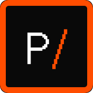
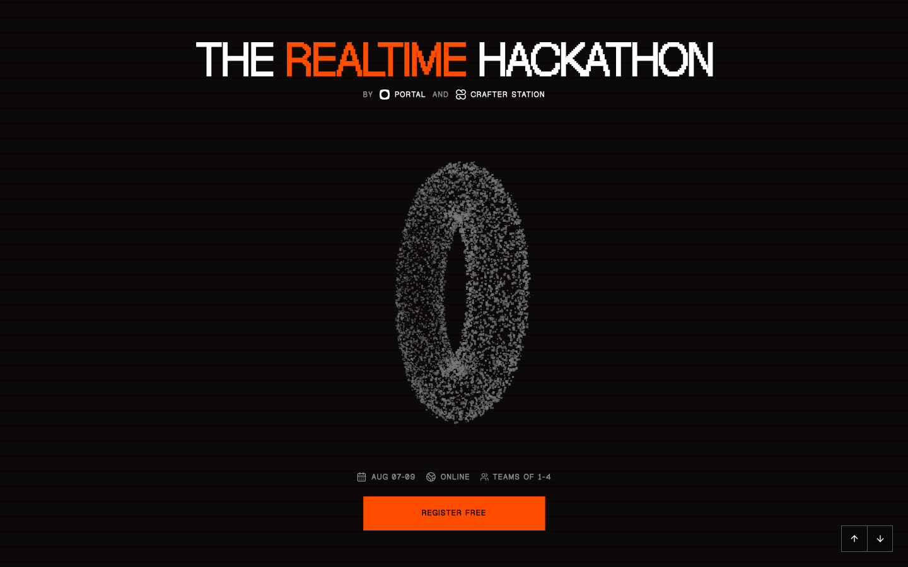
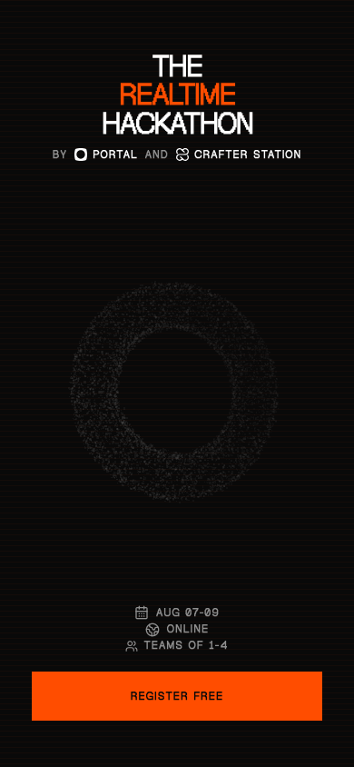

<div align="center">
  <a href="https://hack.useportal.co">
    
  </a>

  <h1>The Realtime Hackathon</h1>

  <p><strong>Build AI that happens now.</strong></p>

  <p>
    A 39-hour online hackathon for developers building live, multiplayer, and
    agentic products with Portal.
  </p>

  <p>
    <a href="https://hack.useportal.co"><strong>Visit the event site</strong></a>
    ·
    <a href="https://luma.com/realtime-hackathon">Register free</a>
    ·
    <a href="https://docs.useportal.co/">Portal docs</a>
  </p>
</div>



## About The Event

The Realtime Hackathon is an online build weekend presented by
[Portal](https://useportal.co/) and
[Crafter Station](https://crafter.run/). Participants have from August 7 to
August 9, 2026 to create a working product in one of four tracks:

| Track | Challenge |
| --- | --- |
| **Co-op AI** | People and agents sharing one live workspace |
| **Live Systems** | Products that act on changing data |
| **Crowd Mode** | Experiences shaped by the audience |
| **Wild Signal** | Realtime experiments without a category |

Teams can have one to four members. The event awards **US$800 in cash
prizes**, with US$500 for first place and US$300 for second place.

## Site Highlights

- Interactive Three.js particle scenes rendered with custom shaders
- Full-screen, editorial sections for tracks, schedule, prizes, judging, and FAQ
- Keyboard and on-screen section navigation
- Responsive layouts designed for desktop and mobile
- Reduced-motion support and accessible semantic controls
- Event metadata, Open Graph artwork, JSON-LD, and a web app manifest
- Matching mentor and judge confirmation emails with personalized PDF letters

## Mobile Preview

<p align="center">
  
</p>

## Tech Stack

| Area | Technology |
| --- | --- |
| Framework | [Next.js 16](https://nextjs.org/) App Router |
| UI | [React 19](https://react.dev/), TypeScript, Tailwind CSS 4 |
| 3D graphics | [Three.js](https://threejs.org/) |
| Components | [Base UI](https://base-ui.com/), shadcn-style primitives, Lucide icons |
| Email | [React Email](https://react.email/) and React PDF |
| Tooling | [Bun](https://bun.sh/), Biome, TypeScript |
| Hosting | [Vercel](https://vercel.com/) with Web Analytics |

## Getting Started

### Prerequisites

- [Bun](https://bun.sh/) installed locally

The website does not require environment variables for local development.

### Install And Run

```bash
git clone https://github.com/crafter-station/the-realtime-hackathon.git
cd the-realtime-hackathon
bun install
bun dev
```

Open [http://localhost:3000](http://localhost:3000).

## Available Commands

| Command | Purpose |
| --- | --- |
| `bun dev` | Start the Next.js development server on port 3000 |
| `bun run build` | Create a production build |
| `bun start` | Run the production build |
| `bun run lint` | Check the repository with Biome |
| `bun run format` | Format supported files with Biome |
| `bunx tsc --noEmit` | Type-check without emitting files |
| `bun test` | Run the Bun test suite |
| `bun run email:dev` | Preview React Email templates on port 3001 |
| `bun run email:export` | Export email templates to `.email-output/` |

Run the full verification suite before opening a pull request:

```bash
bun run lint
bunx tsc --noEmit
bun test
bun run build
```

## Project Structure

```text
.
├── docs/                  # Operational documentation and README images
├── emails/                # Confirmation emails and PDF letter components
├── public/brand-assets/   # Generated web, social, video, email, and icon assets
├── scripts/               # Brand and official-letter generators
└── src/
    ├── app/               # App Router page, metadata, styles, and 3D scenes
    ├── components/ui/     # Reusable interface primitives
    └── lib/               # Shared utilities
```

The primary website entry points are [`src/app/page.tsx`](./src/app/page.tsx)
and [`src/app/layout.tsx`](./src/app/layout.tsx). Interactive particle and
navigation components live in [`src/app/components/`](./src/app/components/).

## Email Confirmations

The repository also contains operational confirmation emails and personalized
PDF letters for accepted mentors and judges. Previewing, exporting, generating,
and sending those files has additional privacy and sequencing requirements.

Read [`docs/email-confirmations.md`](./docs/email-confirmations.md) before
working with recipient data or generating deliverables. Never commit recipient
lists, private meeting links, signature images, or API keys.

## Brand Assets

Generated campaign artwork is stored in
[`public/brand-assets/`](./public/brand-assets/). Platform post images are grouped
under [`social/`](./public/brand-assets/social/), videos under
[`video/`](./public/brand-assets/video/), and web, email, favicon, and app-icon
assets remain at the root. Their dimensions and palette are recorded in
[`public/brand-assets/assets.json`](./public/brand-assets/assets.json).

`bun run brand:generate` overwrites the complete tracked asset set and requires
the local **Geist Pixel Regular** font. Run it only when intentionally
regenerating every brand output.

## License

This project is licensed under the [MIT License](./LICENSE).
